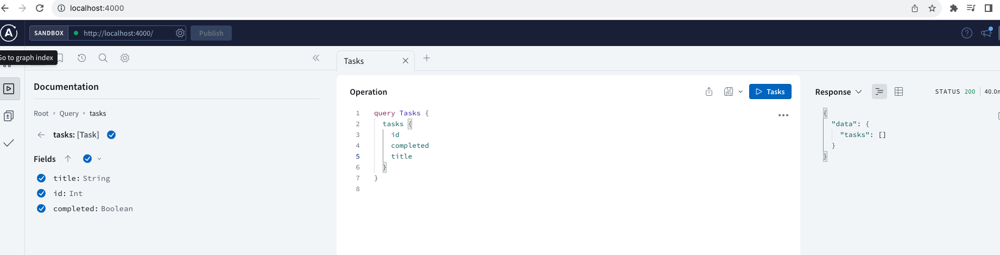
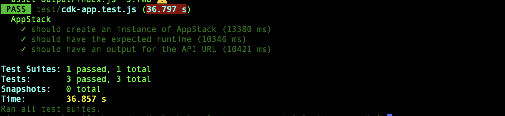

# Postgres Server + AWS CDK + Apollo Server + AWS Lambda 

A GraphQL API for a task management application. Users are be able to
create, read, delete, update and delete tasks. Additionally, users are able to mark tasks as completed
and filter tasks based on their status. 

# Install AWS CDK
`npm install -g aws-cdk`

# Creating an Amazon RDS PostgreSQL database
Sign in to AWS Console:
Navigate to the AWS Management Console.
Sign in to your AWS account if you're not already logged in.

Access RDS Service:
Click on "Services" in the top left corner.
Under the "Database" section, select "RDS."

Clone the repo and run `npm install`

Create .env and ormconfig.json files
Add environment variables

# Run locally
`npm run start`

# Deploying to AWS
`npm run cdk deploy`

The `cdk.json` file tells the CDK Toolkit how to execute your app.

# Run tests 
`npm run test`    perform the jest unit tests (the docker must be daemon running)

## Useful commands

* `npm run build`   compile typescript to js
* `npm run watch`   watch for changes and compile
* `cdk deploy`      deploy this stack to your default AWS account/region
* `cdk diff`        compare deployed stack with current state
* `cdk synth`       emits the synthesized CloudFormation template
